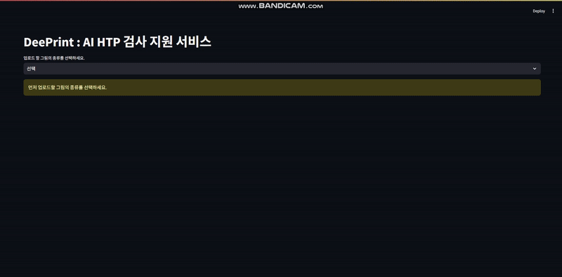

# DeepPrint

AI 기반 HTP 검사 보조 프로그램

---

## 🔍 프로젝트 소개

**DeepPrint**는 심리 평가에서 활용되는 HTP(집-나무-사람) 검사 결과를 AI 기반으로 자동 분석하는 보조 프로그램입니다.  
YOLO 객체 감지 모델을 활용해 집, 나무, 사람을 자동 감지하고, 이를 기반으로 심리적 특성을 평가하여 검사 효율성과 정확성을 향상시키는 것을 목표로 합니다.

---

## 🎥 시연 영상 <👇클릭하세요👇>
<a href="https://youtu.be/xcK26iobhLY" target="_blank">
  
</a>

---

## 👥 팀 정보

- **팀 프로젝트** (총 3명)
- **팀원:** 정재식, 김지민, 박형빈
- **프로젝트 기간:** 2025.03.10 ~ 2025.04.10

---

## 🧑‍💻 나의 역할 (정재식)

- **HTP 검사용 YOLO11 모델 학습 및 최적화**
- **입력 이미지 크기 및 학습 속도 최적화**
- **객체 감지 결과 기반 JSON 데이터 변환**
- **심리적 해석 룰 기반 분석 로직 구현**
- **OOP(객체지향 프로그래밍) 기반 코드 구조화**

---

## 📈 프로젝트 주요 기능

- **YOLO 기반 객체 감지**: 집, 나무, 사람 요소를 자동 감지
- **심리적 해석 자동화**: 감지 결과를 JSON으로 변환 후 심리적 특성 분석
- **룰 기반 해석 로직**: 감지된 요소의 크기, 위치, 개수에 따른 심리 평가
- **객체 지향적 코드 구조화**: 클래스 기반 구조로 유지보수성과 확장성 확보

---

## 🛠️ 프로젝트 기술 스택

- **AI 모델**: YOLO11
- **프로그래밍 언어**: Python
- **라이브러리**: OpenCV, NumPy, Matplotlib, JSON
- **개발 환경**: Jupyter Notebook

---

## 🖥️ 시스템 아키텍처 요약

- **입력 이미지 업로드** → YOLO11 모델을 통한 객체 감지 →  
- **감지된 객체 정보(JSON 변환)** → 룰 기반 심리 해석 적용 → 결과 출력

---

## 📊 프로젝트 과정

1. **아이디어 도출 및 기획**
   - HTP 검사의 자동화를 통한 심리 평가 효율성 향상 목표 수립
   - 객체 감지와 심리 해석을 연계하는 시스템 구상

2. **시스템 설계**
   - YOLO11 기반 개별 객체 감지 모델 설계
   - 감지 결과를 JSON 데이터로 변환하여 해석 가능한 구조 설계

3. **핵심 기능 개발**
   - 집, 나무, 사람 감지를 위한 YOLO11 모델 학습
   - 입력 이미지 크기(imgsz) 조정 및 학습 속도 최적화(epochs 조절)
   - 감지 결과를 바탕으로 크기, 위치 분석 및 심리적 해석 적용

4. **코드 구조화 및 최적화**
   - 객체 지향 프로그래밍(OOP) 방식으로 데이터 처리 로직 구조화
   - 감지된 객체 데이터를 효과적으로 다루기 위한 JSON 설계

5. **테스트 및 검증**
   - 다양한 HTP 검사 데이터를 대상으로 모델 성능 및 해석 결과 검증
   - 기존 연구 데이터와 비교하여 해석 정확도 평가

6. **성과**
   - HTP 검사 자동 분석 시스템 프로토타입 완성
   - YOLO11 기반 모델을 활용한 높은 객체 감지 정확도 확보
   - 자동화된 심리 해석 적용 가능성 검증

---
## 📊 프로젝트 결과 및 회고

- **HTP 검사 결과를 자동 감지하고 심리 해석까지 이어지는 프로세스 구축**
- **YOLO11 모델 최적화로 객체 감지 성능 개선**
- **룰 기반 심리 해석 자동화 가능성 검증**

**한계점:**
- 심리 해석 정밀도를 높이기 위해 추가 연구 데이터 확보 필요
- 개별 사용자 스타일 차이를 반영하는 데 한계 존재
---

## 🌐 설치 및 실행 방법

### 요구사항
- Python 3.8 이상
- 필요한 Python 패키지 (requirements.txt 참조)

### 설치 및 실행

1. 패키지 설치:
  ```bash
   pip install -r requirements.txt
  ```
2. 프로젝트 실행:
  ```bash
  python src/main.py
  ```


**향후 개선 계획:**
- YOLO 모델 업그레이드를 통한 객체 감지 성능 향상
- 다양한 심리 검사(KFD, BGT 등)로 자동 해석 범위 확장
- 추가 데이터 수집 및 학습을 통한 심리 해석 정확도 개선
