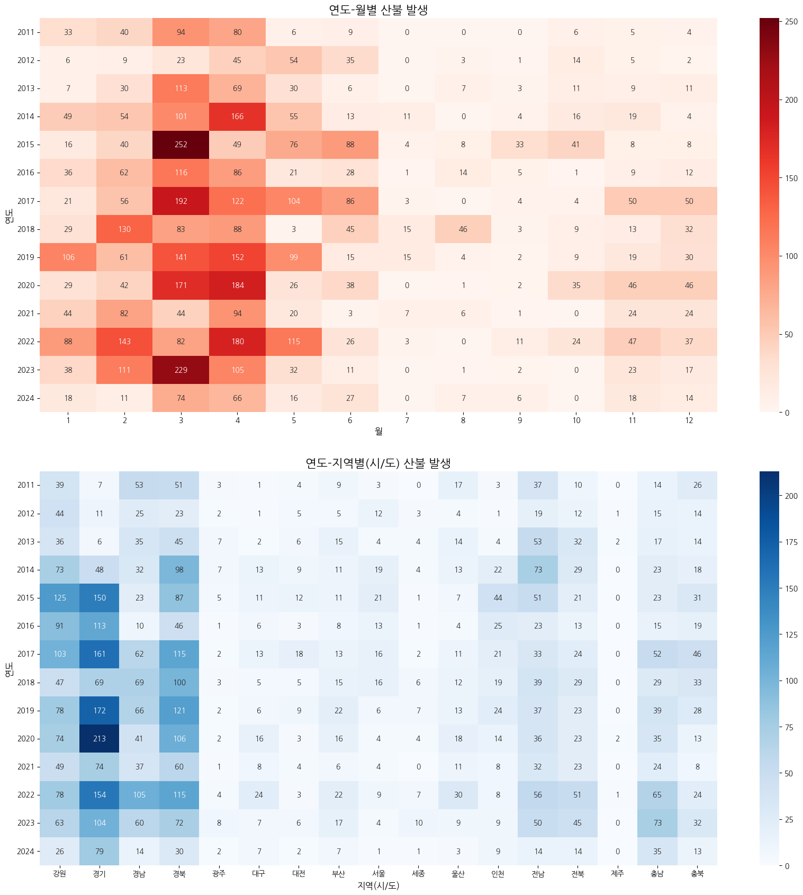
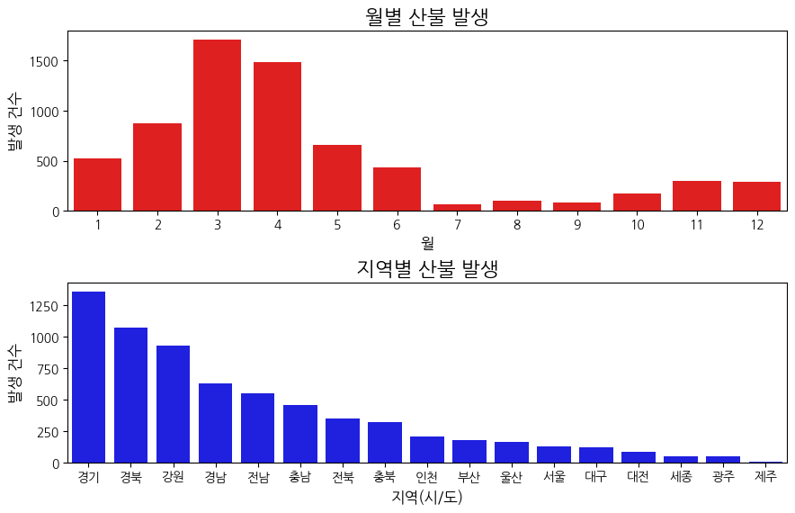

# ML기반 산불 발생 예측 시스템: Predict_fire_forest(2025.01 ~ 2025.02)


---

## 1. 프로젝트 소개

**Predict_fire_forest**는 전국 산불 발생 데이터를 기반으로 머신러닝을 활용해 산불 발생 여부를 사전에 예측하여   
재해 예방을 위한 모델 개발을 목표로 한 프로젝트입니다.  
산불은 빠르게 확산되어 막대한 피해를 초래할 수 있으므로, 데이터 기반 예측 시스템 구축을 통해 빠르고 정확한 대응이 가능하도록 지원합니다.

---

## 2. 수행 역할(데이터 마이닝)

### 1) 데이터 수집  
산불 발생에 영향을 미치는 데이터 조사하여 비중이 큰 상위 3개의 원인과 관련된 데이터를 수집하였습니다.


| 산불 원인 유형             | 관련 데이터                            | 데이터 출처 |
|-----------------------------|------------------------------------------|----------------|
| 입산자실화 데이터       | 인구 데이터, 토지 데이터(묘지)           | [행정안전부](https://jumin.mois.go.kr), [KOSIS](https://kosis.kr/statHtml/statHtml.do?sso=ok&returnurl=https%3A%2F%2Fkosis.kr%3A443%2FstatHtml%2FstatHtml.do%3F...%3D%26) |
| 기타 데이터            | 기상 데이터                              | [기상청 AP](https://apihub.kma.go.kr) |
| 농산부산물 소각 데이터       | 토지 데이터(농지)                        | [KOSIS](https://kosis.kr/statHtml/statHtml.do?sso=ok&returnurl=https%3A%2F%2Fkosis.kr%3A443%2FstatHtml%2FstatHtml.do%3F...%3D%26) |

### 2) 데이터 분석

아래의 그림은 산불 발생 이력 데이터를 Heatmap 형태로 시간·공간적 분포를 직관적으로 보여주는 데 초점을 맞춰 시각화한 결과입니다.  
연도·월별 및 연도·지역별 산불 발생 패턴을 한눈에 확인할 수 있으며, 특정 시기(봄철) 및 지역(강원, 경북 등)에 집중되는 양상을 보입니다.



아래의 바 플롯은 앞서 제시한 히트맵과 **동일한 데이터를 기반으로** 월별 및 지역별 산불 발생 건수를 막대그래프 형태로 시각화한 것입니다. 


### 3) 데이터 전처리

데이터 통합
| 처리 방식 | 적용 설명 |
|-----------|-----------|
| merge     | 산불 발생, 인구, 기상, 토지 데이터를 날짜 및 시/군/구 단위로 병합 |
| groupby   | 통합된 데이터프레임을 **날짜, 시/군/구 단위**로 묶어 통계 분석 수행 (예: 일별 평균, 지역별 합계 등) |
| mapping   | **시/군/구의 위·경도**를 기반으로 가장 가까운 **기상 관측소와 연결**하여 날씨 정보 매핑 

결측치 처리
| 항목 유형   | 변수명                                   | 처리 기준 |
|-------------|-------------------------------------------|------------|
| 강수량       | `rain`                                    | 0으로 대체 |
| 토지 정보    | `total_area`, `field_area`, `paddy_area`, `cemetery_area` | 동일 지역의 **전년도 값**으로 대체 |
| 기온 정보    | `tempAvg`, `tempMin`, `tempMax`           | 동일 지역의 **같은 달 평균**으로 대체 |
| 습도 정보    | `humMin`, `humAvg`                         | 동일 지역의 **같은 달 평균**으로 대체 |
| 풍속 정보    | `windMax`, `windAvg`                       | 동일 지역의 **같은 달 평균**으로 대체 |

예제 코드
```python
weather_columns = ['tempAvg', 'tempMin', 'tempMax', 'windMax', 'windAvg', 'humMin', 'humAvg']
for col in weather_columns:
    filled_df[col].fillna(filled_df.groupby(['dateYear', 'dateMonth', 'sgg_nm'])[col].transform('mean'), inplace=True)

area_columns = ['total_area', 'field_area', 'paddy_area', 'cemetery_area']
for col in area_columns:
    filled_df[col] = filled_df.groupby('sgg_nm')[col].transform(lambda group: group.ffill().bfill())
```
### 4) 피처 엔지니어링
**클래스 불균형**
- 산불 발생 데이터는 미발생 데이터에 비해 클래스가 매우 부족하기에 초기에 SMOTE를 활용한 오버샘플링을 적용하였으나
- 여전히 클래스 부족문제로 인해 TP(산불 발생 예측)에 비해 TN(산불 미발생 예측)이 압도적으로 많이 잡히는 문제가 발생하여
- 언더샘플링과 오버샘플링을 조합하여 사용하였습니다.
```python
smote = SMOTE(sampling_strategy=0.5,random_state=42)
under = RandomUnderSampler(sampling_strategy=0.5,random_state=42)
pipeline = Pipeline(steps=[('smote',smote),('under',under)])
```
**스캐일링**
- 인구, 면적 등의 데이터를 밀도로 변환하였습니다.   
    - ex) 부산 인구 / 전체 인구 = 부산 인구 밀도
- 스케일 차이 때문에 특정 특성이 모델을 좌지우지하지 않도록 StandardScaler 사용하였습니다.
```python
# 인구, 면적 등의 데이터를 밀도로 변환
data['farm_ratio'] = (data['paddy_area'] + data['field_area']) / data['total_area']
data['cemetary_ratio'] = data['cemetery_area'] / data['total_area']
data['population_density'] = data['population'] / data['total_area']

# StandardScaler 사용
scaler = StandardScaler()
X_train_scaled = scaler.fit_transform(X_train_resampled)
X_test_scaled = scaler.transform(X_test)
```
### 5) 모델 학습

모델 성능 향상을 위해 LogisticRegression, RandomForest, XGBoost, LGBMClassifier에 대해 GridSearchCV 기반의 하이퍼파라미터 튜닝을 수행하였습니다.    
모델별 주요 하이퍼파라미터를 설정하고, 각 파라미터에 대해 다양한 값을 실험하여 최적의 조합을 탐색하였습니다.

첫 번째 표는 하이퍼파라미터의 의미와 역할을 설명하며,  
두 번째 표는 각 모델별로 실제 실험에 사용된 파라미터의 탐색 범위를 정리한 것입니다.

| 하이퍼파라미터       | 설명 |
|----------------------|------|
| `C` (LogisticRegression)         | 규제 강도. 값이 작을수록 규제가 강해져 모델이 단순해짐 (과적합 방지 목적). |
| `n_estimators` (Tree 계열)       | 생성할 트리(또는 부스팅 반복)의 개수. 많을수록 성능 향상 가능하나 학습 시간 증가. |
| `max_depth` (Tree 계열)          | 트리의 최대 깊이. 깊을수록 복잡한 패턴을 학습하지만 과적합 위험 증가. |
| `min_samples_leaf` (Tree 계열)   | 리프 노드에 있어야 하는 최소 샘플 수. 과적합 방지를 위해 사용. |
| `num_leaves` (XGBoost)           | 하나의 트리에서 생성할 수 있는 리프 노드 수. 복잡한 패턴 학습 가능하나 과적합 주의. |
| `learning_rate` (XGBoost, LGBM)  | 학습률. 낮을수록 학습 속도는 느리지만 성능이 안정적일 수 있음. |

<table>
  <thead>
    <tr>
      <th>모델</th>
      <th>하이퍼파라미터</th>
      <th>값 범위</th>
    </tr>
  </thead>
  <tbody>
    <tr>
      <td rowspan="1">LogisticRegression</td>
      <td>C</td>
      <td>[0.01, 0.1, 1, 10, 100]</td>
    </tr>
    <tr>
      <td rowspan="3">RandomForestClassifier</td>
      <td>n_estimators</td>
      <td>[100, 300, 500]</td>
    </tr>
    <tr>
      <td>max_depth</td>
      <td>[None, 10, 20, 30]</td>
    </tr>
    <tr>
      <td>min_samples_leaf</td>
      <td>[2, 5, 10]</td>
    </tr>
    <tr>
      <td rowspan="3">XGBClassifier</td>
      <td>n_estimators</td>
      <td>[100, 300, 500]</td>
    </tr>
    <tr>
      <td>num_leaves</td>
      <td>[31, 63, 127]</td>
    </tr>
    <tr>
      <td>learning_rate</td>
      <td>[0.01, 0.1, 0.2]</td>
    </tr>
    <tr>
      <td rowspan="3">LGBMClassifier</td>
      <td>n_estimators</td>
      <td>[100, 300, 500]</td>
    </tr>
    <tr>
      <td>max_depth</td>
      <td>[None, 10, 20, 30]</td>
    </tr>
    <tr>
      <td>min_samples_leaf</td>
      <td>[2, 5, 10]</td>
    </tr>
  </tbody>
</table>

### 6) 모델 평가
초기에는 이진 분류 모델의 성능을 평가할 때 주로 사용되는 `ROC-AUC`를 사용하였지만 TP(산불 발생 예측)에 비해 TN(산불 미발생 예측)이 많이 잡혀 `ROC-AUC`가 과대 평가되었고 지표를 신뢰할 수 없게 되어
클래스가 불균형할 때 사용하는 `PR-AUC`를 지표로 평가하였습니다. 그러나 프로젝트 기간의 부족으로 인해 `PR-AUC` 성능을 끌어올리는데 실패하였습니다.      

#### **각 모델별 Confusion matrix**
    

#### **각 모델별 성능**
| 모델                  | Accuracy | ROC-AUC | Precision | Recall | PR-AUC |
|-----------------------|----------|---------|-----------|--------|--------|
| LogisticRegression     | 0.72     | 0.83    | 0.02      | 0.78   | 0.04   |
| RandomForestClassifier | 0.99     | 0.80    | 0.08      | 0.03   | 0.03   |
| XGBClassifier          | 0.99     | 0.81    | 0.11      | 0.01   | 0.04   |
| LGBMClassifier         | 0.99     | 0.82    | 0.03      | 0.002  | 0.04   |

#### **ROC-AUC**


#### **PR-AUC**


## 3. 이슈발생 및 해결과정

## 4. 프로젝트 회고

**한계점:**    
먼저, 산불은 발생 자체가 매우 드문 사건이다 보니 대부분의 모델이 '산불 없음'으로 예측하는 경향을 보였습니다.  
이로 인해 정확도(accuracy)는 높게 나타났지만, 실제로 산불이 발생한 경우를 제대로 잡아내지 못하는 한계가 있었습니다.    
또한, 국내 산불은 자연 발화보다는 입산자에 의한 실화가 주요 원인이었는데,  
입산자의 활동이나 행태를 반영할 수 있는 데이터를 확보하지 못해 보다 정밀한 예측이 어려웠습니다.    
기상 데이터 측면에서도 한계가 있었습니다. 모든 시군구에 기상관측소가 존재하는 것이 아니다 보니, 각 지역의 중심 좌표를 기준으로 가장 가까운 관측소의 데이터를 연결했는데, 이 과정에서 실제 산불 발생 지점의 기상 상황과는 차이가 생길 수 있었습니다.     
결과적으로 이러한 오차는 예측 모델의 성능에 부정적인 영향을 줄 수 있었습니다.

**향후 개선 계획:**
- GAN을 이용한 클래스 불균형 문제를 완화 시킬수 있을 것이라 예상
- Stacking Classfier 활용: 여러 모델(Logistic Regression, XGBoost, LightGBM 등)의 예측 결과를 메타 모델에 결합하여 예측 성능 향상
- 더 다양한 Feature를 추가해 학습을 고도화가 필요.
    - 지형 및 토지 이용 관련 : 경사도 및 고도, 토양, 수분량 등
    - 인간 활동 관련 : 쓰레기 및 불법 소각 데이터, 캠핑장 및 등산로 분포
