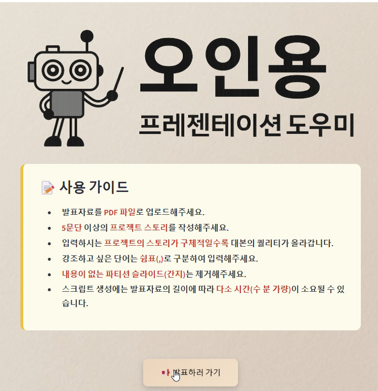

# AI 발표 자동화 시스템: Presentation Agent(2025.03 ~ 2025.04)


## 1. 프로젝트 소개

**Presentation-Agent**는 발표 준비 과정에서 느끼는 불안과 스트레스를 줄이기 위해,  
PDF 문서로부터 텍스트와 이미지를 추출해 **자동으로 발표 대본을 생성하고**, 이를 자연스러운 **TTS 음성**으로 변환하는 발표 도우미 시스템입니다.  
또한, 발표 자료 기반 **실시간 Q&A 챗봇** 기능을 지원하여 발표 도중 질문에도 대응할 수 있습니다.

---

## 2. 시연 영상 <👇클릭하세요👇>
<a href="https://youtu.be/sj9HZPMtha8" target="_blank">
  
</a>

---

## 3. 수행 역할

### **LLM** 기반 발표 대본 자동 생성 파이프라인 구축
> PDF 업로드 → 텍스트/이미지 추출 → 이미지 분석 → LLM 입력 → 대본 생성  
- **1. PDF 업로드**: FastAPI를 통해 사용자가 PDF 파일을 업로드.
- **2. 텍스트/이미지 추출**: PyMuPDF를 활용해 각 페이지의 텍스트와 이미지 바이트를 추출.
- **3. 중요 이미지 판별**: Vision LLM(GPT 기반)을 통해 이미지가 차트인지 여부와 페이지 내 차지 비율을 기준으로 필터링.
- **4. 비전 모델 분석 결과 + 텍스트 → LLM 전달**: 추출된 이미지 설명과 텍스트를 LLM(GPT 기반)에 입력하여 대본 생성을 수행.
- **5. 페이지별 발표 대본 생성**: 전체 문서 내용과 이전 페이지 요약 내용을 함께 참고하여, 흐름이 자연스러운 발표 대본을 자동으로 생성.

### **TTS**를 활용한 발표 대본 음성 생성 파이프라인 구축 (Google TTS)  
> 페이지별 스크립트 → 키워드 강조 SSML 변환 → Google TTS → .wav 생성 → base64 반환  
- 사용자가 선택한 성별(TTS 음색)에 따라 다른 Google TTS 음성을 사용.
- 페이지별 대본에서 강조할 키워드를 벡터 유사도 기반으로 자동 추출하여 SSML 태그로 강조.
- 대문자 단어(API, GPT 등)는 철자 읽기 처리(<say-as>)로 변환하여 자연스러운 발음을 지원.
- SSML 변환 후 Google TTS API에 요청해 .wav 파일을 생성하고, base64 인코딩된 결과를 반환.
- 기존 오디오 파일은 요청마다 초기화하여 디렉토리 충돌을 방지.


### **FastAPI**를 통한 백엔드 서버 구축 및 API 개발  
- `POST /generate-script`  
  PDF에서 텍스트와 이미지를 추출하고, LLM을 통해 발표 대본을 생성.
- `POST /generate-audio`  
  생성된 대본을 기반으로 페이지별 음성을 생성.
- `POST /export-presentation`  
  PDF를 PPTX로 변환하고 음성을 삽입해 ZIP 파일로 제공.
---

## 4. 시스템 아키텍처

- **PDF 업로드** → 텍스트/이미지 추출 → 대본 생성 → 키워드 강조 → SSML 삽입 → TTS 음성 생성
- **VectorDB 저장** → 웹 검색 병합 → 실시간 Q&A 챗봇 응답
- **Streamlit UI**를 통한 통합 제공  


---
## 5. 이슈 발생 및 해결 과정

### 1. 발표용 시각자료와 장식용 이미지를 어떻게 판별할 것인가?   
[자세히 보기](https://velog.io/@wotlr6894/%EB%B0%9C%ED%91%9C%EC%9A%A9-%EC%8B%9C%EA%B0%81%EC%9E%90%EB%A3%8C-vs-%EC%9E%A5%EC%8B%9D-%EC%9D%B4%EB%AF%B8%EC%A7%80-%EA%B5%AC%EB%B6%84-%EB%A1%9C%EC%A7%81%EC%9D%98-%ED%95%9C%EA%B3%84%EC%99%80-%ED%95%B4%EA%B2%B0-%EC%8B%9C%EB%8F%84) 
### 2. 프롬프트를 통한 반복적인 인사말 문제 개선  
[자세히 보기](https://velog.io/@wotlr6894/%ED%94%84%EB%A1%AC%ED%94%84%ED%8A%B8%EB%A5%BC-%ED%86%B5%ED%95%B4-%EC%84%B1%EB%8A%A5-%EA%B0%9C%EC%84%A0)  
### 3. 자연스러운 발표 억양을 위한 키워드 강조 처리
[자세히 보기](https://velog.io/@wotlr6894/%EC%9E%90%EC%97%B0%EC%8A%A4%EB%9F%AC%EC%9A%B4)

---

## 6. 프로젝트 회고

### **한계점:**
시스템 구조상 토큰 초과 문제는 일정 부분 해결되었으나, 슬라이드 수가 많은 발표 자료의 경우에는 여전히 한계가 존재합니다.
특히 전체 문맥을 고려해 대본을 생성하는 과정에서는 LLM의 입력 토큰 제한에 가까워질 수 있으며,
이로 인해 일부 슬라이드가 누락되거나 모델 응답이 비정상적으로 출력될 가능성이 있습니다.
현재는 슬라이드 단위 분할 처리 및 요약 전략을 통해 이 문제를 완화했지만, 장문의 자료 처리에는 추가적인 토큰 최적화가 필요한 상황입니다.  

또한, 현재 시스템은 GPT 및 Google Cloud 기반의 외부 API 모델에 의존하고 있어 몇 가지 실질적인 한계가 존재합니다.
데이터가 외부 서버를 통해 처리되기 때문에 보안성과 독립성 측면에서 제약이 있을 뿐만 아니라,
API 자체의 안정성이나 사용량 제한 등에 따라 서비스 품질이 영향을 받을 수 있습니다.  

실제로 우리가 프로토타입 발표를 진행하던 날, GPT 모델 측에서 이미지 변환 기능과 관련한 문제로
API 통신이 원활하지 않았고, 이로 인해 시연 과정에서 원래 의도한 성능을 보여주지 못한 사례가 있었습니다.
이러한 경험은 시스템의 일관된 작동을 위해서라도 외부 API 의존도를 줄이거나, 자체 모델 도입 등 대안 마련이 필요함을 보여줍니다.

### **향후 개선 계획:**
시스템의 안정성과 독립성을 강화하기 위해, 현재 사용 중인 외부 API 기반 구조에서 벗어나
로컬 환경에서 직접 운영 가능한 모델로 전환하는 것을 우선적인 개선 방향으로 고려하고 있습니다.
이를 통해 보안성을 높이고, 외부 서비스 장애나 비용에 대한 의존성 문제도 함께 해소할 수 있을 것으로 기대됩니다.  

또한, 발표 대본 생성 및 음성 출력 과정에 직접 파인튜닝한 LLM과 TTS 모델을 적용하여
사용자 맞춤형 결과의 정밀도를 높이고자 하며, 발표 중에는 청중의 실시간 반응을 수집하고 해석하는 기능을 추가해
실시간 피드백 기반의 인터랙티브한 발표 지원 시스템으로 확장할 계획입니다.

---

## 📂 프로젝트 구조

```
Presentation-Agent/
├── streamlit/          # Streamlit 웹 인터페이스
│   ├── app.py         # 메인 애플리케이션
│   └── assets/        # 정적 리소스
├── fastapi/           # 백엔드 API 서버
|   ├── core/          # AI 핵심 기능
│   ├── main.py        # FastAPI 애플리케이션
│   ├── models.py      # 데이터 모델
│   ├── routes.py      # API 라우트
│   ├── utils.py       # 유틸리티 함수
│   └── prompts/       # AI 프롬프트
└──  data/              # 데이터 저장소
```

---

## 🌐 설치 및 실행 방법

### 요구사항
- Python 3.8 이상
- 필요한 Python 패키지 (requirements.txt 참조)

### 설치 사항

1. 필요한 API 키 설정:
   - OpenAI API 키
   - Google Cloud API 키 (음성 합성용)

2. API 키 설정 방법:
   ```bash
   # .env 파일 생성
   touch .env
   
   # .env 파일에 다음 내용 추가
   OPENAI_API_KEY=your_openai_api_key_here
   GOOGLE_CLOUD_API_KEY=your_google_cloud_api_key_here
   ```

3. Python 패키지 설치:
   ```bash
   # 가상환경 생성 (선택사항)
   python -m venv venv

   # Windows
   .\venv\Scripts\activate

   # Linux/Mac
   source venv/bin/activate

   # 필요한 패키지 설치
   pip install -r requirements.txt
   ```
